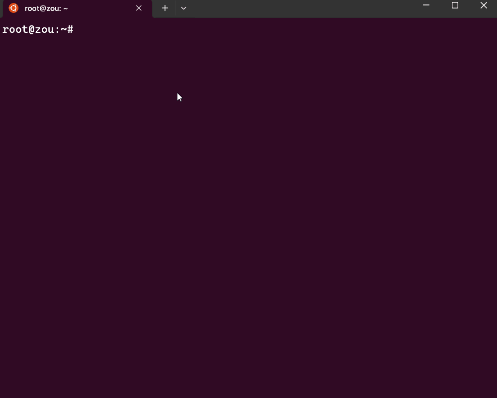
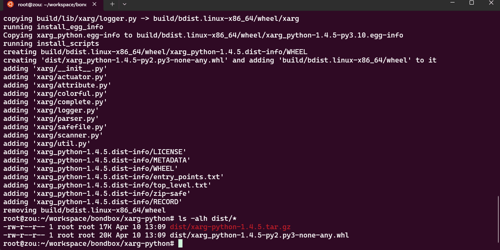
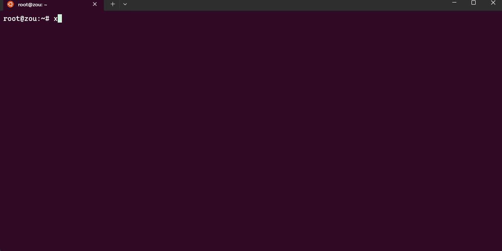

# xpip

无需任何改动，快速构建、安装和上传 Python 包。

## 为什么会有 xpip

编包与分发对于任何开源项目都是十分重要的。相对编码，这个操作比较低频，时常会遇到问题或者错误（如：依赖包没有安装）。

开发 `xpip` 的初衷是让构建、发行 Python 包更加的简单和高效，而不是成为一个必须且无法替代的打包工具或包管理器。它仅仅是简化了`setuptools`、`twine`、`pip`等工具的使用，以便让 Python 的开发者专注于编码。

## 演示

### [xpip-build](xpip-build.md)

一条 `xpip-build setup --clean --all --install` 命令即可在**任何平台**简单、快速的构建（.whl和.tar.gz）、安装 Python 包。

### [xpip-upload](xpip-upload.md)

一条 `xpip-upload dist/*` 命令即可在**任何平台**快速的将 Python 包上传至 [PyPI](https://pypi.org/) 仓库。

### [xpip-mirror](xpip-mirror.md)

自由的切换镜像源。

## 要求

[xpip-mirror](#xpip-mirror) 由于依赖 [xarg-python](https://github.com/bondbox/xarg-python)，要求`Python >= 3.8`。
[xpip-build](#xpip-build) 和 [xpip-upload](#xpip-upload) 没有限制（推荐`Python >= 3.8`）。

## Makefile

建议为项目创建 [Makefile](../resouce/Makefile)，构建和上传 Python 包更简单、快速。
